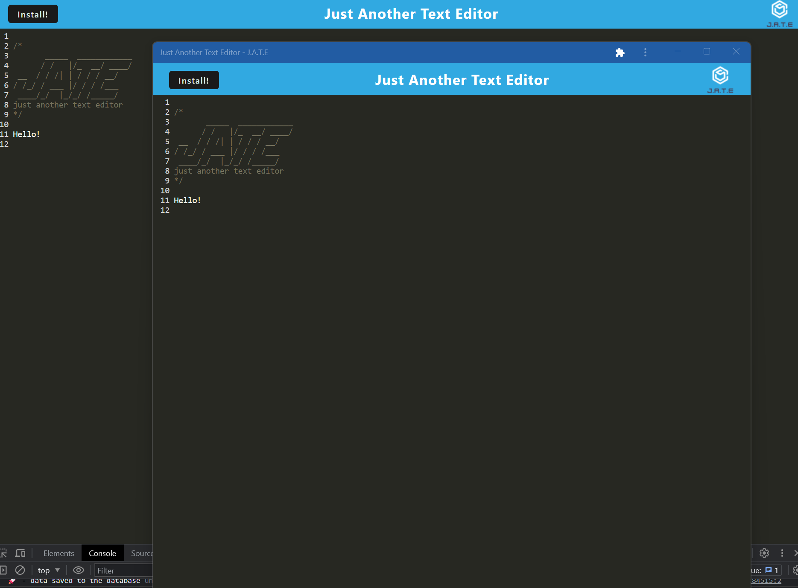

# PWA Text Editor Homework

## Activity

- For this activity I added PWA functionality to the JATE (Just Another Text Editor) application.

## User Instructions

- This is a PWA (Progressive Web App) Text Editor. 
- You may use this as a normal text editor or install the application locally and use it in offline mode.
- Your data will be stored in offline mode and reconnected when you are online again.

## Screenshot

- Here is a screenshot of the working webpage and the installed PWA.

## Working Code

- Here is a link to a working version of my code:
[PWA-Text-Editor-Homework](https://pwa-homework-text-editor-a2b38e8745a7.herokuapp.com/)